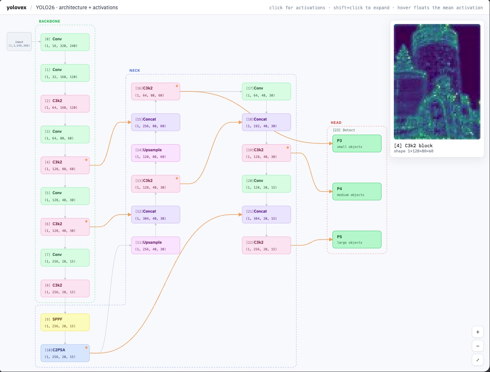
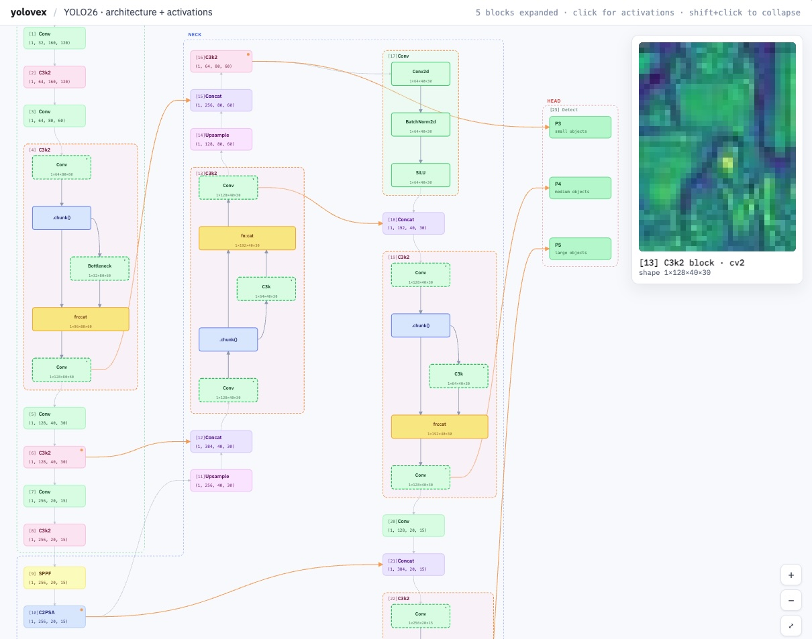
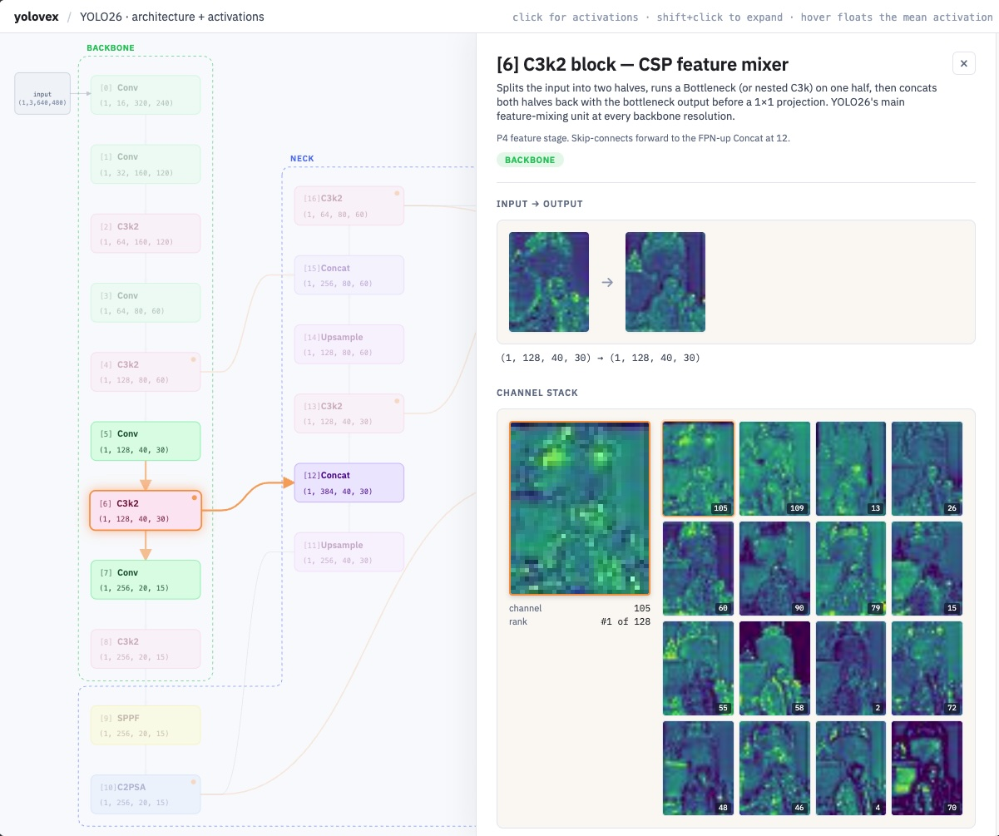

# yolovex

**yolovex** — short for *YOLO Visual EXplainer*, and yes, because I was a bit vexed trying to wrap my head around YOLO architectures. It's an interactive way to explore [YOLO26](https://docs.ultralytics.com/) (currently yolo26n), inspired by [CNN Explainer](https://poloclub.github.io/cnn-explainer/) but built block-by-block for a modern detector.

You can drill into every block, peel it open down to the leaf modules (Conv2d, BN, SiLU, MaxPool, attention internals, …), and see the actual activations the network produces on a real image.



## What's in here

- **Full YOLO26n architecture, laid out as a graph.** Backbone, Neck (the L-shaped FPN-up + PAN-down region), and Head — same shape as the paper diagrams, but interactive: pan, zoom, fit-to-screen, the works.
- **Click any block to peel it open in place.** A `Conv` block becomes Conv2d → BN → SiLU. `C3k2` becomes cv1 / chunk / bottleneck / cat / cv2. `SPPF` decomposes into its three max-pools and concat. `C2PSA`'s attention block unfolds all the way down to qkv / proj / position embed / ffn — each leaf module is its own node. Shift+click on any sub-component to keep peeling further. Neighbours slide aside; nothing resizes awkwardly.
- **Every node has a real activation captured on a sample image.** Hover a block (or any sub-component, at any depth) and the floating tile on the right shows that node's mean-channel activation, stretched to the same aspect ratio as the input image so you can compare spatial patterns across the whole network at a glance.



- **Click a node and a side panel opens** with the full story: the input(s) feeding in, the output coming out, a top-16 channel brochure (hover to preview, click to pin), and the tensor's shape + statistics. A short learner-friendly blurb tells you what that layer type is actually doing.



- **The whole thing is methodical, not hardcoded.** The architecture comes from an fx trace of the actual loaded model, the activation capture walks every fx node via a `torch.fx.Interpreter`, and the frontend reads both. Swap in any compatible image and the visualisation updates — no hand-written per-block special cases.

## Quick start

```bash
uv sync
uv run yolovex build-assets-v2           # captures activations on the default image
open frontend/v2/yolovexv2.html          # or serve it any way you like
```

The first run auto-downloads `yolo26n.pt` via Ultralytics. The default image (`assets/sammit_lighthouse.jpg`) is bundled.

Once it's open:

- **hover** anything → floating tile follows you
- **click** a block or sub-component → side panel opens with the channel stack
- **shift+click** → peel it open into its internals (repeat to go deeper)
- **escape** or **click outside the panel** → close it

### What else is in there

- **Detect side panel** — clicking the Detect head (or P3 / P4 / P5) opens a panel with bbox overlay on the input image, a confidence slider plus a numeric input (type any value for runners-up), a horizontal bar chart of survivors colored by class, and a per-class score heatmap grid (rows = top-N classes by peak, columns = P3 / P4 / P5 — choose how many classes to show, capped at 12). Class names come from `model.names`, not hardcoded — drop in any image and the panel adapts.
- **Play flow** — the ▶ button in the header animates the active activation through every currently-rendered node in dataflow order. Expand a block first and the traversal walks its internals. Slow / medium / fast speed. The run ends on the Detect head's annotated bbox frame, which sticks around as the "final result" until you hover something else or play again. Nodes without a 4-D tensor (e.g. `chunk`, elementwise `add`) keep showing the previous step's activation instead of snapping back to the raw input.
- **Settings drawer** — ⚙ in the header. Live-tune all the layout constants (row / col gaps, container padding, node size, edge tail lengths, neck offsets — split into independent foot and body), edge / accent colors, container dash, CSS tokens, and the brochure / scale-grid tile scales. Reset restores defaults.
- **Light / dark theme** — ☾ button in the bottom-right zoom cluster flips the page chrome, panels, and graph canvas. SVG node fills stay light pastel by design so they pop against the dark canvas.

## CLI tour

A few other things `yolovex` can do from the command line:

```bash
uv run yolovex layers          # table of every block — type, role, shape, params
uv run yolovex describe 9      # everything we know about one block
uv run yolovex show 5 --top 16 # render activations for a block to PNGs
uv run yolovex predict         # the detection head — boxes + per-scale heatmaps
uv run yolovex trace 200 400   # follow one input pixel through every layer
uv run yolovex graph           # paper-shaped SVG of the architecture
uv run yolovex report          # one-page HTML report you can share
```

## Layout

```
src/yolovex/      # all the Python — model loading, fx tracing, activation capture, CLI
frontend/v2/      # the interactive explorer (this is the one in the screenshots)
frontend/         # earlier L1 / L2 iterations, still runnable
assets/           # the default sample image
results/          # screenshots used in this README
```

If you're curious about how this got built — earlier experiments, design notes, evolution from L1 → L2 → v2 — see [`DEVNOTES.md`](DEVNOTES.md).
